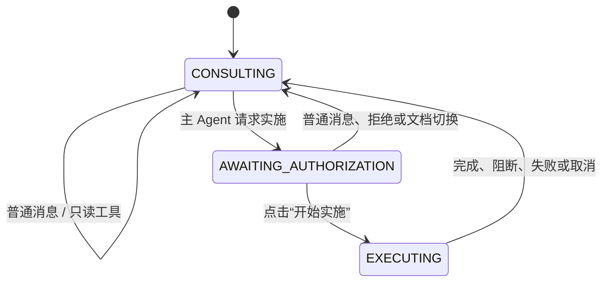

# 协商与专家实施分离：技术设计

## 1. 设计目标

把文档编辑链路拆为两个不可混淆的状态：

```text
协商（主 Agent、只读）
  └─ 主 Agent 请求实施
      └─ 用户点击“开始实施”
          └─ 实施（临时 DispatchPlan、专家计划、集中事务提交、质量验收）
```

协商阶段不生成可提交的计划、不调度写专家、不修改内存文档或磁盘文件。实施阶段由一次显式授权产生，结束后回到协商。

## 2. 分层与职责

| 组件 | 职责 | 禁止事项 |
|---|---|---|
| `PrimaryConversationAgent` | 多轮协商、只读工具调用、请求授权、授权后生成 `DispatchPlan`、面向用户解释阻塞/验收 | 写工具、直接 `Operation`、直接提交 |
| `ReadOnlyToolRegistry` | 按能力元数据只暴露 `READ/QUERY` 工具；优先 `view_*` | 暴露或仅靠运行时拦截写工具 |
| `DispatchPlan` | 一次实施的短生命周期合同：任务、专家组、依赖、验收条件、文档基线 | 跨会话复用、替代用户可见草案 |
| `LlmToolGroupExpert` | 仅基于被分配任务和相关快照，生成所属组 `ExpertPlan/Operation` | 直接写文档、访问完整协商历史、生成跨组操作 |
| `ExecutionCoordinator` | 校验基线、按依赖并行规划、合并/review、集中提交、回滚、质量验收 | 从自然语言或 `relevantTo()` 猜测分派 |
| `CommitCoordinator` | 既有唯一写入口；串行调用 `OperationExecutor` | 用户授权判定、专家选择 |
| `TraceJournal` | 将全部应用、LLM、工具、专家、提交事件写入 JSONL 并实时广播 | 记录 API Key |

专家固定为 `body`、`table`、`header-toc`、`revision`、`quality`。`session`、`view`、`capability` 只由编排/主 Agent 读取使用。

## 3. 会话状态机



`AWAITING_AUTHORIZATION` 只保存一次性授权候选上下文，不保存用户可编辑或版本化的草案。按钮请求携带服务器签发的一次性授权 token；token 仅在当前文档代次、当前会话、当前待授权状态下有效。前端普通聊天请求不可伪装为授权。

## 4. 实施链路

1. 授权端点校验 token、会话状态和当前文档代次，创建执行锁与取消令牌。
2. 编排层重新构建最新 `DocumentSnapshot`，计算文档指纹，要求与授权时的文档代次匹配；不匹配则阻断并返回协商。
3. 主 Agent 以协商记忆、最新快照和授权目标临时输出结构化 `DispatchPlan`。解析时校验工具组白名单、任务非空、依赖无环、验收条件存在。
4. `ExecutionCoordinator` 只按 `DispatchPlan` 取专家。无依赖任务经受限线程池并行规划；依赖任务等待前置任务完成。专家入参仅为分配、全局约束、验收条件和相关快照片段。
5. 合并 `ExpertPlan`，沿用稳定 `Operation`、`ConflictKey`、去重和 review 协议。任一专家失败、无效输出、冲突或 `BLOCKED` 均不进入提交。
6. 以当前磁盘文件为事务恢复点，串行执行已 review 的操作。每个操作前检查取消令牌和文档基线。失败或取消时，关闭并重新打开恢复点文档，递增会话代次；不保存本次改动。
7. 所有写操作成功后保存文档、刷新 OnlyOffice key，再重建快照并分派只读 `quality` 验收。质量失败保留已成功的编辑，状态为“实施完成，验收未通过”，禁止自动修复。
8. 完成、阻断、失败或取消均释放执行锁、失效授权 token，并回到 `CONSULTING`。

## 5. 合同

### `DispatchPlan`

必须包含：`dispatchId`、`conversationId`、`documentGeneration`、`documentFingerprint`、用户确认的目标摘要、全局约束、按工具组的 `ExpertAssignment`、依赖边、验收条件。`ExpertAssignment` 包含工具组、任务文本、相关元素 ref/片段、前置 assignment id。

禁止把主 Agent 的自然语言回复当作计划。主 Agent 的普通回复与结构化 `DispatchPlan` 分别解析和 trace。

### 专家输出

沿用 `ExpertPlan`/`Operation`，但 `LlmToolGroupExpert` 的 parser 必须验证：

- 输出 `toolGroup` 与被分配组相同；
- `kind` 属于现有对应 `OperationExecutor` 支持集；
- ref、payload 和 snapshot generation 有效；
- 不存在未授权的跨组操作。

### 读工具

主 Agent 的 registry 物理上只注册只读适配器，适配器调用 toolkit 原有读方法。能力来源为 `@ToolCapability`，只接受 `READ/QUERY`；`CREATE/UPDATE/DELETE` 不进入 schema。before interceptor 仅作为第二道防线和 trace 记录，不承担唯一授权边界。

## 6. 并发与一致性

底层 `DocxToolkit` 不可并发写。并发仅限专家的纯 LLM 规划：每个专家获得不可变快照/片段，不调用写工具。`CommitCoordinator` 保持单线程顺序，`DocSession` 的上传、重置、执行都纳入同一会话锁；上传/重开使授权和执行基线失效。

事务恢复点是尚未保存的当前磁盘文件。提交期间禁止保存；回滚以重新打开恢复点替代对 POI 活对象的逆向补丁。保存成功后的质量验收不是事务失败条件，符合“已实施但验收失败”的产品语义。

## 7. 可观测性与回放

所有事件统一为带 `conversationId`、`turnId`、`dispatchId`、时戳、序号、事件类型和安全载荷的 trace 事件：用户消息、主 Agent LLM/工具事件、授权请求/授权、`DispatchPlan`、专家 LLM/计划、merge/review、逐操作提交、取消、回滚、save、质量验收和终态。

`TraceJournal` 先追加 JSONL，再将同一事件 SSE 推给浏览器；读取端点按会话返回历史，以便页面首次加载回放。Prompt、工具参数、工具结果和 thinking 属于 Demo 所需可见数据；API Key、Authorization header 与环境变量必须在入库和 SSE 前剔除。

## 8. API 与迁移

- 删除 `RouterAgent.run()` 和由其驱动的 `DocxOrchestrator.run/chat/plan` 自动执行路径；同步删除其测试、SSE `analyze/plan/commit` 假设和单一 `LlmDocxExpert`。
- `DocxOrchestrator` 收敛为文档会话、快照、执行器注册和事务恢复原语；新 `ConsultationCoordinator` 成为 Demo 唯一入口。
- `Operation`、`MergedPlan`、review、`CommitCoordinator`、各 `OperationExecutor` 保留为内部协议，并改造 `CommitCoordinator` 的失败结果以驱动回滚。
- `/api/chat` 只处理协商；新增授权、取消、trace 回放端点。OnlyOffice 仅在保存成功后收到 `doc_changed`。

## 9. 风险与防线

| 风险 | 防线 |
|---|---|
| LLM 将普通协商误当授权 | 仅服务器授权 token + 按钮入口可执行 |
| 主 Agent 调用写工具 | registry 物理白名单 + before interceptor + 测试 |
| 多专家输出冲突 | 结构化分配、`ConflictKey`、review、阻断不提交 |
| 部分写入 | 保存前不落盘；失败/取消 reopen 恢复点 |
| 文档切换导致写错目标 | generation + 指纹校验；切换时失效授权/取消执行 |
| trace 泄露密钥 | 固定脱敏器、trace 测试扫描敏感字段 |
